# Uber Driver Schedule Optimization
## Part 1: Introduction
One of Uber’s key value propositions is offering scheduling flexibility to their driver-partners. According to a report by the Beneson Strategy Group, 73% of drivers prefer having a job that lets them choose their schedule. Drivers can use this flexibility to maximize their expected revenue during their available times. To this end, Uber provides heatmaps of customer demand that allow drivers to target high-demand regions that provide higher trip probability and therefore higher expected revenues. 

However, there is no readily available way to determine whether trips starting at a particular location are worth the time it would take to service the trip. For example, a trip that takes longer due to traffic but has high demand may result in fewer total trips and be less valuable. On the other hand trips with less demand but are consistently much faster may be more valuable. Therefore it is in the driver’s best interest to balance the demand of a location and the amount of time trips from that location will take. 

**To address this gap, the team sought to create a scheduling optimization model, using Mixed Integer Programming (MIP).**

<br>

## Part 2: Data Collection
Two datasets were used to determine **demand** and **trip duration**. Because Uber demand data was not available, DC Taxicab pickup data was used as a proxy for demand. Duration was determined from an Uber Movement dataset.

### DC Taxicab Data - Demand
The dataset was sourced from Open Data DC. It describes individual taxicab trips from a specific location expressed in coordinates. From January to March, the dataset contains a total of 5,546,786 pickups at 10,843 different locations. 

In order to discretize the data and scope down the size of our problem, we needed to sort the pickups into high demand regions. First, the number of pickups at each location was counted. Then, to define the regions we selected the first 100 locations with the most pickup counts (see Figure 1-1) as they cover 30% of the total number of pickups. MATLAB’s kmeans function was used to cluster the counts into 5 region centroids (see Figure 1-2). The radius of each region was calculated based on the minimum Euclidean distance to the other four regions.

> Table 1: High-Demand REgion Parameters

|Region|Latitude|Longitude|Radius|
|---|---|---|---|
|0|38.9036460|-77.0520803|0.015496908|
|1|38.8978792|-77.0262628|0.012656732|
|2|38.9051074|-77.0366525|0.012656732|
|3|38.8933596|-77.0088673|0.017972991|
|4|38.9219662|-77.0471676|0.018967425|

> Figure 1 - 1: Taxicab Pickups in D.C.

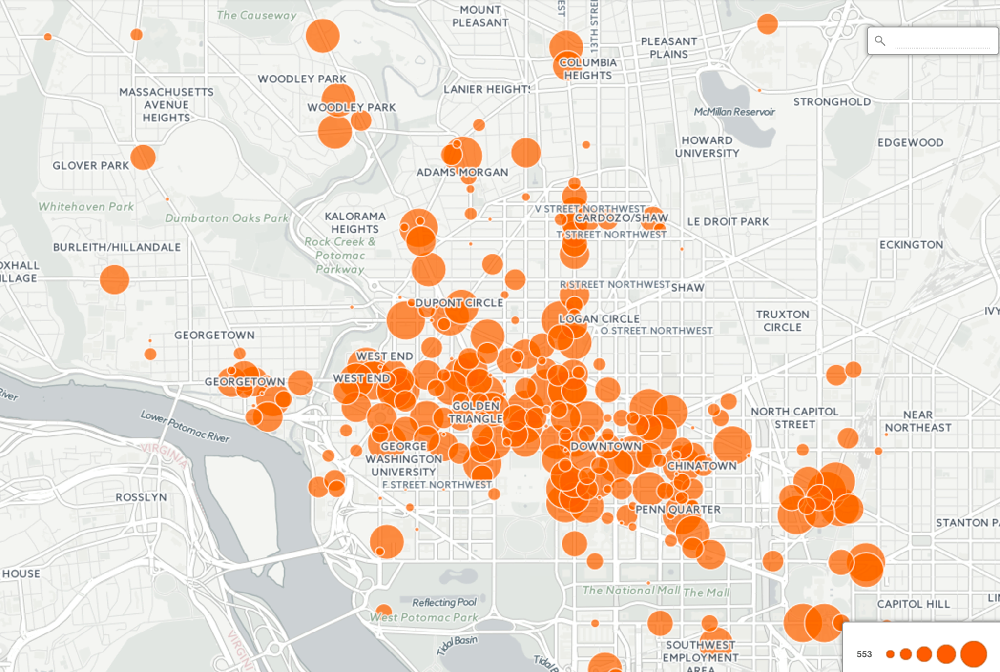 

> Figure 1 - 2: High Demand Pickup Regions in D.C.

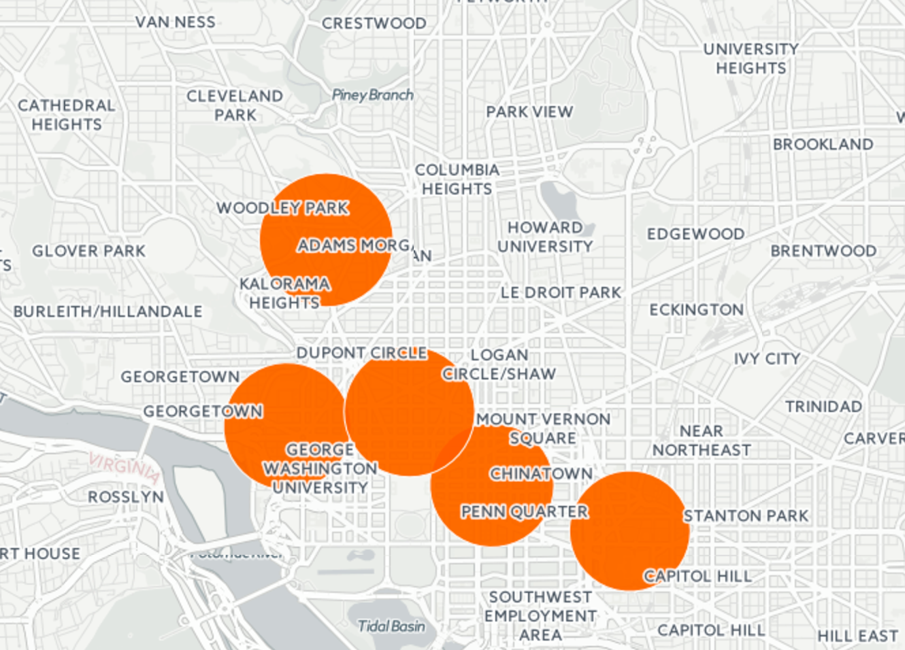

<br>
Since we only compare the intra-region trips, pickup counts were then filtered to only include trips that originated from one of the five regions and whose destinations are within the same region as the origin. Counts were then averaged and aggregated across the time of day, day of week, and region. A sample of the cleaned, discretized dataset can be found below.

> Table 2: Sample of Demand Data (cleaned) used for Model

|Weekday|Hour|Region|Avg_Pickups|
|---|---|---|---|
|1|0|0|34.76923077|
|3|2|2|49.69230769|
|5|23|1|44.66666667|
|7|6|4|111.2307692|

<br>

### Uber Movement Data - Trip Duration

The dataset was sourced from Uber’s “Uber Movement” initiative (see Appendix A). It describes the mean, minimum, and maximum trip durations for each origin-destination region pair. Uber Movement’s regions are smaller than the five high-demand regions determined earlier. In order to make the two datasets comparable, origin-destination pairs were filtered to only include regions that fell completely within one of the five regions and whose destinations are within the same region as the origin (see Figure 2). The average mean, minimum, and maximum of trip durations for each of the five regions was then calculated. Similar to the demand data, these values were aggregated over the time of day, day of week, and region. A sample of the dataset can be found below.

> Figure 2: High Demand regions over-laid over Uber Regions

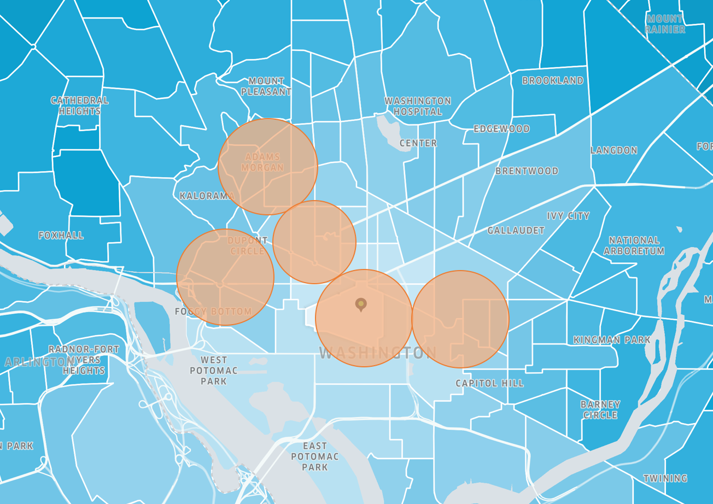

> Table: Sample of Trip Duration Data (cleaned) used for the model

|Weekday|Region|Hour|Avg Max Duration(s)|Avg Mean Duration(s)|Avg Min Duration(s)|
|---|---|---|---|---|---|
|5|3|2|824.428|522.142|341.142|
|5|3|4|601.857|388.0|257.857|
|5|3|5|588.714|381.571|254.714|
|5|3|1|843.142|494.571|300.428|

<br>

## Part 3: Methods 
Using the demand and trip duration data, a [Mixed Integer Programming](http://www.gurobi.com/resources/getting-started/mip-basics) (MIP) model was developed to find the optimal driving schedule for drivers. MIP’s are linear optimization programs where some variables are allowed to be integers while others are not once a solution has been obtained. 

The most famous MIP is one that is analogous to ours: the [knapsack problem](https://en.wikipedia.org/wiki/Knapsack_problem). In our case, the backpack’s capacity represents the “total time” the Uber driver has allocated for their schedule. We would like to maximize the expected revenue. The following MIP was developed:


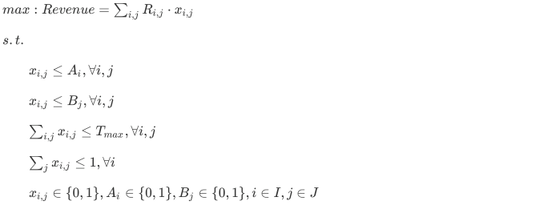

### Objective Function
The objective function of the model maximizes the revenue made for the driver over the course of their work schedule for one week. This is accomplished by maximizing the sum of the expected revenues at each recommended region j and time block i. The expected revenue term R_{ij} is calculated according to:

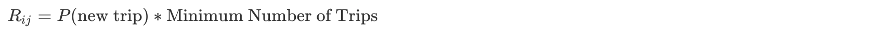

Where we assume that the probability of new trips is uniformly distributed between 0.5 and 1 as the 5 regions were chosen based on high demand. Based on this assumption, probability can be assigned using demand (see Appendix B).

Number of trips at a given time was found for the worst case scenario by using the minimum number of trips possible in each set of region j and time block i. Because the time blocks were subdivided into 2 hour blocks, the minimum number of trips can be approximated as:


<br>

### Decision Variables and Parameters
The decision variable in the model is `X_{ij}`, where i and j indicate the corresponding time and region respectively. `X_{ij}` is a boolean variable where 1 indicates the region j at time i is selected. The following parameters are used in the model:

- R_{ij} - Expected revenue driver can make at region j during time i
- A_{i} - Boolean variable to indicate whether driver is available during block i
- B_{j} - Boolean variable to indicate whether drive is able to work in region j
- T_{max} - Maximum number of hours driver can work in a week

<br>

### Constraints
Uber is attractive due to its scheduling flexibility. An Uber driver can work whenever and wherever they want. To accurately model flexibility, the MIP is subject to these constraints: 

- Constraints 1 and 2 ensure that the optimal schedule generated does not include regions the driver is not willing to work in or times they are not available. 
    - In constraint 1, A_{i}=1indicates that the driver is available to drive at time block i, and 0 otherwise. 
    - In constraint 2,B_{j}=1indicate the driver is willing to drive in region j, and 0 otherwise. 
- The constant Tmax ensures that the schedule’s total number of hours will not exceed the maximum number of hours the driver is willing to work per week. 
- Constraint 4 ensures that only one region is recommended for each time block. 
- Constraint 5 ensures that decision variable X_{ij} and parameters A_{i} and B_{j} are binary. 

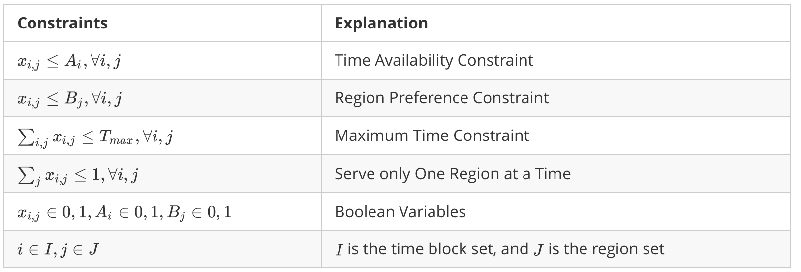

<br>

### MATLAB Implementation
In order to actually implement the model, a central program was written in MATLAB that prepares the MIP and solves it using the intlinprog function. The central program requires 6 parameters, each corresponding to the decision variables listed in above. The problem had to be formulated for intlinprog, which solves problems of the form:

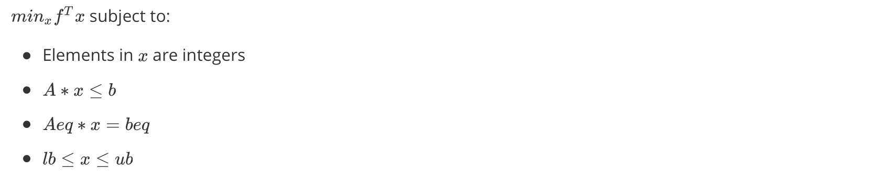

The code can be found in [Launch_IP.m](Launch_IP.m) and [Solve_IP.m](Solve_IP.m)

#### MATLAB: Data Extraction Methods
First, the two datasets extracted from `Taxi Pickup Data` and `Uber Movement Data` were joined on Weekday, Hour, and Region. Each row of the dataset represents the traffic conditions in a given region during a given hour on a given weekday. Extracting the required subset data was done using the `readtable()` function.

#### MATLAB: Constraints

Using the data, the constraints were formulated for intlinprog by constructing the A and b matrices in 3 steps. The first step creates a vector A1, b1 of dimensions `1 x n` that represent the number of hours the Uber driver is willing to work. The second step constructs a matrix A2, b2 that ensures no two regions are recommended at the same time. Finally, A1 is appended to A2, and b1 is appended b2 to make the final matrices A and b. 

The second constraint requires the recommended regions be within the regions the driver is willing to travel to. If the driver is unwilling to drive in a particular region, then all the duration, traffic, and constraint parameters of the region will be removed before creating the constraint matrix. Therefore, there was no need to incorporate region preference into the constraint matrix. The model also assumes that time to get from one region to the next is negligible. A driver may be expected to be in region B during time block `i`, but in region C, 12 miles away for time block `i+1`. The time cost of travelling between regions can be implemented in future iterations. 

#### MATLAB: Objective Function

To represent the objective function, two vectors were established and multiplied together. The first vector represents the probability of getting a customer at the current region during time i, and the second vector represents the estimated number of trips in the time block `i`. The final objective function is found using the following line of code:  

```
f = transpose(P_new_customer.*Min_Trips).*avg_revenue_trip;
```

Where `avg_revenue_trip` is approximated to be $12 based on median earnings per hour and trips per hour information from a 2014 Uber study. 

Now, with the appropriate formulation, the optimal solution can be found by `intlinprog()` with the constructed A,b, and f vectors. Upper and lower bounds were set to 1 and 0 respectively.

<br>

## Part 4: Results
The model is able to generate a weekly schedule given one driver’s specified parameters. For example:

> Model Inputs - Driver's Availability

|Parameters|Value|
|---|---|
|Max # Hours|8 hr/weeek|
|Day Available|Mon, Wed, Fri|
|Time Available|6PM-12AM|
|Zone Available|1,2,3,4,5|

> Model Outputs - Ranked Recommendation to the Driver

|Rec #|Time|Zones|
|---|---|---|
|1|Mon 6-8 PM|3|
|2|Wd 8-10 PM|3|
|3|Fri 6-8 PM|2|
|4|Wed 6-8 PM|2|

To evaluate model performance, 2 metrics were considered: **Model Performance** and **Optimality**. Specifically, the team wanted to know how revenue and computation times were affected when the number of maximum working hours (Tmax), time blocks, and regions increased.  
### Model Performance


To ensure stable results, the model was run 500 times for each instance and the average objective values and computation times were recorded. Time blocks and regions were chosen randomly for each instance to avoid bias. It was found that **the computation time increased as number of time blocks increased but decreased as maximum number of hours increased** (see Appendix C). 

### Optimality

The optimal revenue varied between $450 - $545 / week as the number of available time blocks varied between 1-42 (see Figure 3). An increase in the number of available time blocks represents an increase in driver schedule flexibility towards our defined time blocks. **This positive relationship indicates that the more flexible the driver’s schedule is, the more revenue they can expect to earn**. 

> Figure 3: Optimal Revenue/Week Increases as Driver Availability Increases

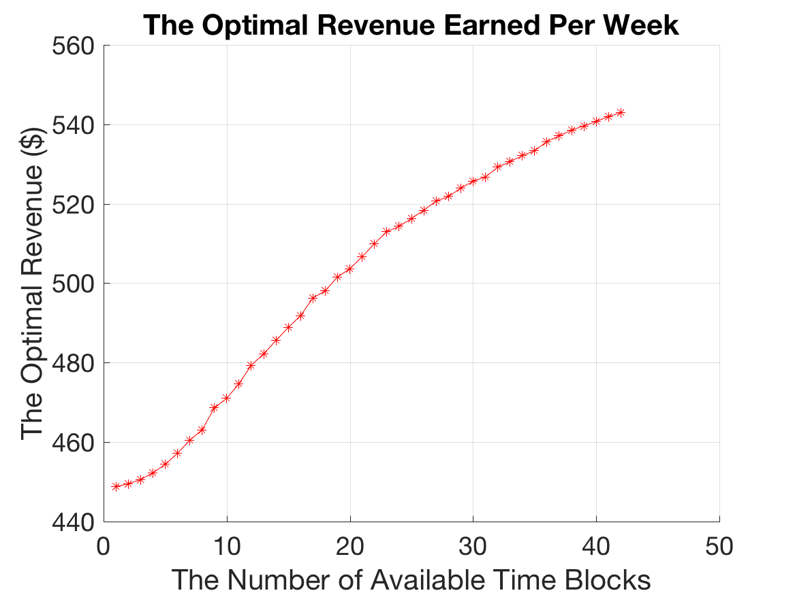

An increase in the number of available regions only caused an increase in revenue when more than one region was included, indicating that more available regions does not significantly impact revenue (see Appendix C).

<br>

## Part 5:  Discussion

There are two potential reasons for an increasing revenue with increasing number of available time blocks. 

First, is “accidental revenue”. This means that the increase in revenue is a result of happening to drive during more high-revenue generating hours on average because of the increased diversity in service times. 

Alternatively, one could simply make more money because they are driving more often. In order to determine the causation, the team plotted the revenue as maximum working hours per week increased (see Figure 4). Increasing the maximum working hours appeared to significantly increase the driver’s revenue, indicating that the time blocks that one is driving during does not affect revenue nearly as much as how often they are driving. 

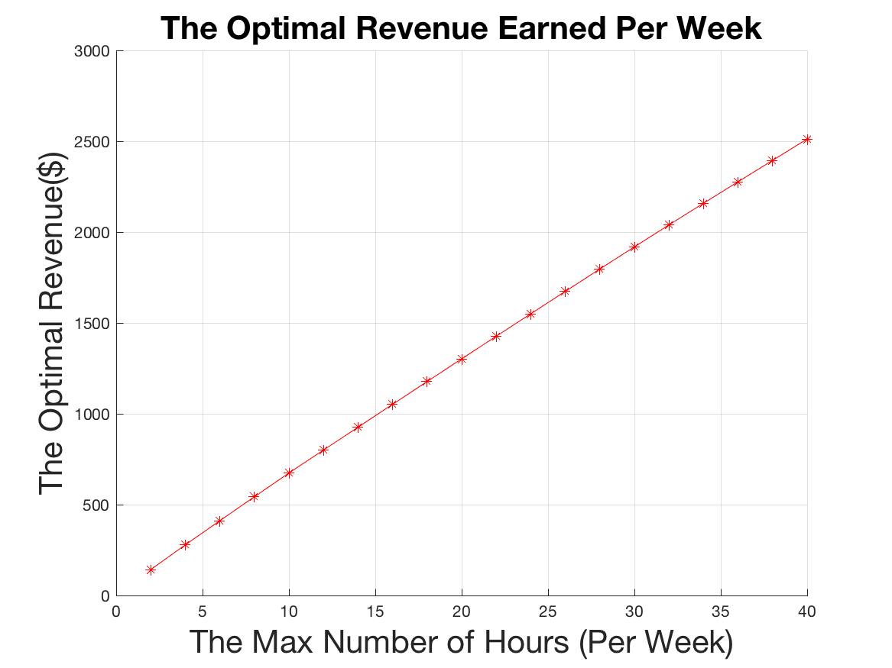

Additionally, the model’s validity was verified by comparing the expected revenue against real-life revenue. According to crowd-sourced information, an Uber driver working 30 hours a week earns approximately $772 per week. From our model, the optimal worst case expected revenue is approximately $1,900. This is significantly higher and indicates our model is a marked improvement on current driver driving patterns.

### Extension

The results from the model make intuitive sense, and show potential for broader applications. It is possible to generalize the model to apply to any city, not just D.C. The team would also like to incorporate a “competition” component to the model. If several drivers are recommended the same region at the same time, competition will increase and the probability of getting a trip goes down for each driver. This clearly decreases the expected revenue according to the formula the team established and would render the optimal solution falsely “optimal”. A more advanced model will be able to balance the number of recommendations it has given for a given region and time and “re-route” drivers to balance the number of drivers with recommendations for a region.

<br>

## Part 6: Conclusion

Based on the MIP model results and interpretations, the team is able to claim that it brings meaningful value to an Uber driver in terms of expected revenue. There is a positive relationship between the number of time blocks prescribed by the model and the expected revenue for the driver. In order to increase their revenue, a driver should be available for as many time blocks as possible. Drivers now have a leg up on other drivers by making data-driven decisions as opposed to using heuristics for picking “optimal” locations to serve clients. With the feasible and convenient schedules that the model prescribes, drivers can now envision their job as a lucrative business with a competitive advantage.

<br>
## Part 7: Reference

[1] Uber Newsroom, "BSG Report: The Driver Roadmap".[Online]. Available: https://newsroom.uber.com/wp-content/uploads/2015/01/BSG_Uber_Report.pdf. [Accessed: 16- Apr- 2017].

[2] Opendata.dc.gov, "Taxicab Trips". [Online]. Available: http://opendata.dc.gov/datasets?q=taxi. [Accessed: 16- Apr- 2017].

[3] Movement.uber.com, "Uber Movement: Let's find smarter ways forward", 2017. [Online]. Available: https://movement.uber.com/cities. [Accessed: 16- Apr- 2017].

[4] J. Hall and A. Krueger, "An Analysis of the Labor Market for Uber’s Driver-Partners in the United States", 2017. [Online]. Available: https://timedotcom.files.wordpress.com/2015/01/uber_driver-partners_hall_kreuger_2015.pdf. [Accessed: 16- Apr- 2017].

[5] I Drive With Uber, "Home - I Drive With Uber", 2017. [Online]. Available: http://www.idrivewithuber.com. [Accessed: 16- Apr- 2017].

## Part 8: Appendix
### Appendix A
The following is the Uber Movement interface the team had to use to access Uber trip duration data. Because the interface restricted the team to having to manually select time blocks and locations, the team had to scope down the locations chosen.

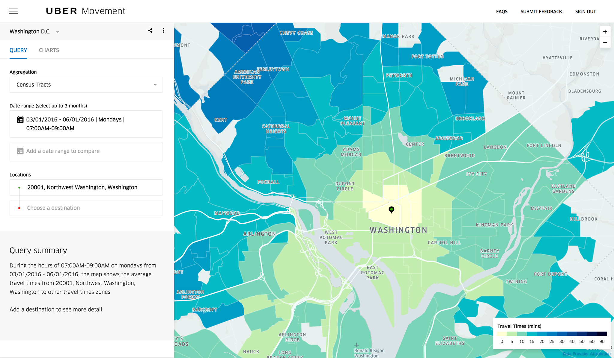

<br>

### Appendix B
The following is the formula implemented in MATLAB to find the probability of new trips:


- P_{min} and P_{max} are the lower and bounds of the uniform distribution used to find probability of new trips (in our case, 0.5 and 1)
- D_{min} and D_{max} are the maximum and minimum pickup counts for that region and time block.

<br>

### Appendix C

The following are supplementary graphs describing the analysis of computation time and objective function given changing parameters.

> Figure below: Increase in revenue with more regions leveling off after two regions

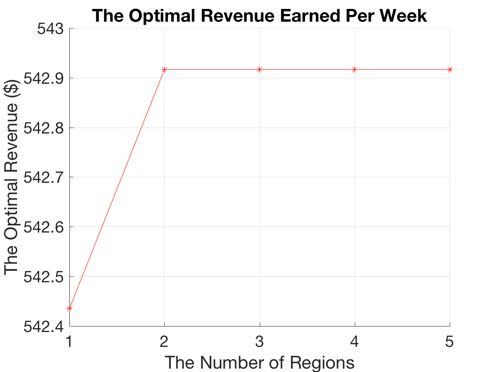

> Figure below: Increasing computation time with more time blocks

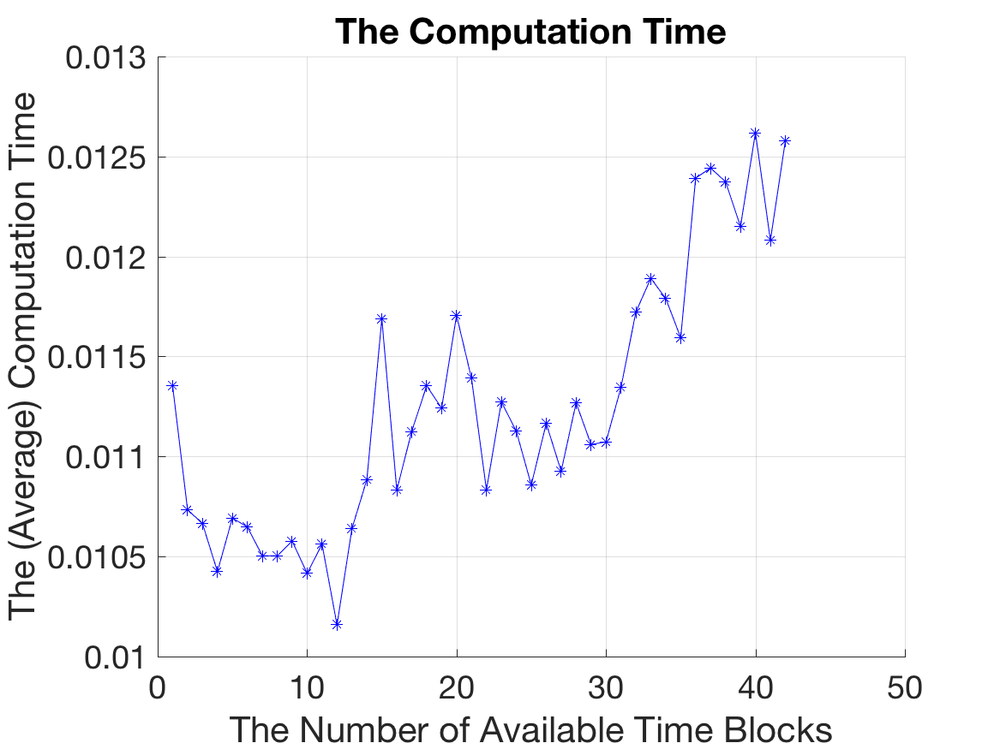

> Figure below: Decreasing computation time with higher T_{max}

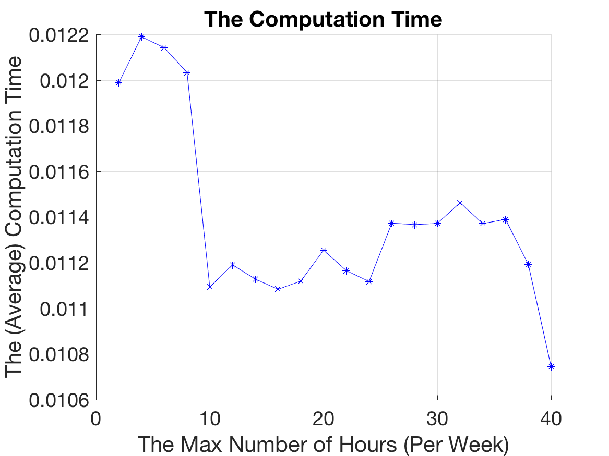

> Figure below: Decreasing computation time with more regions

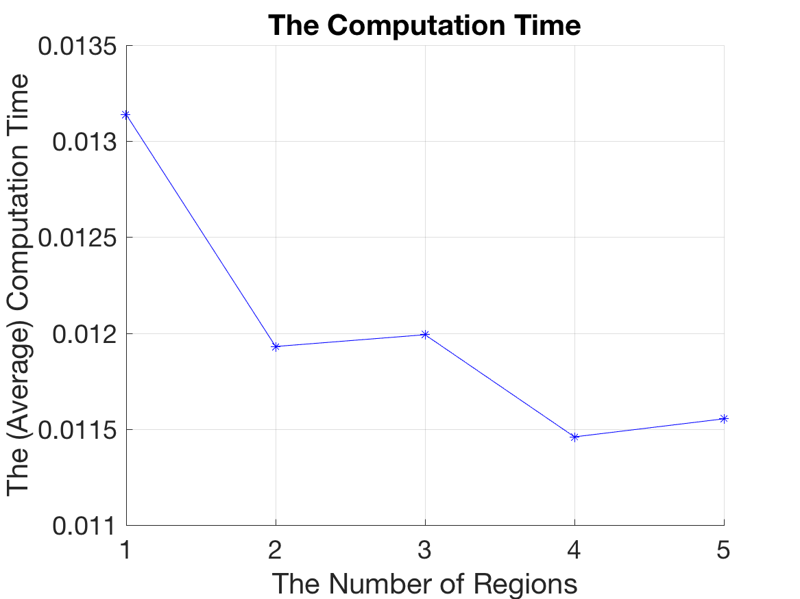


